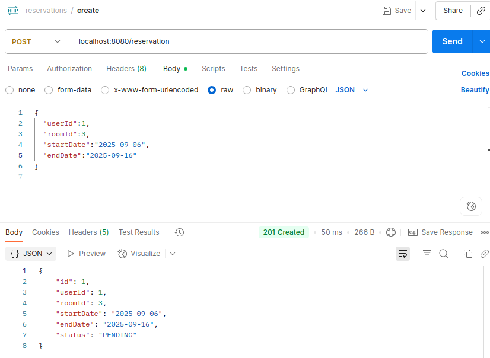
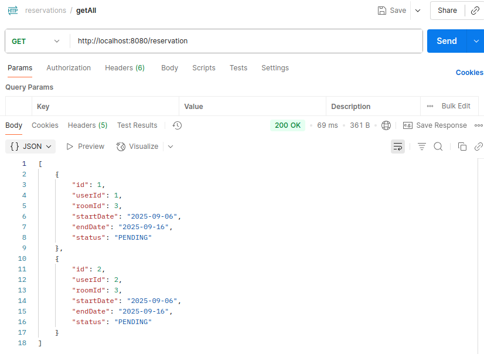
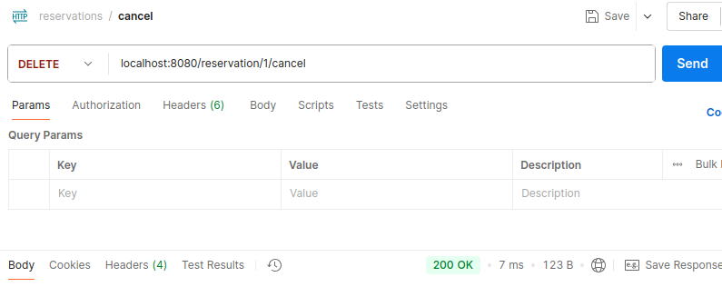
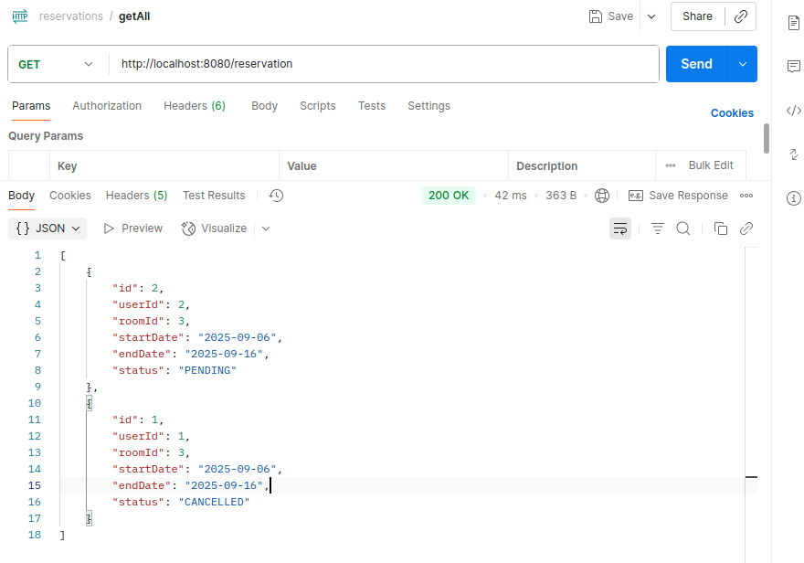
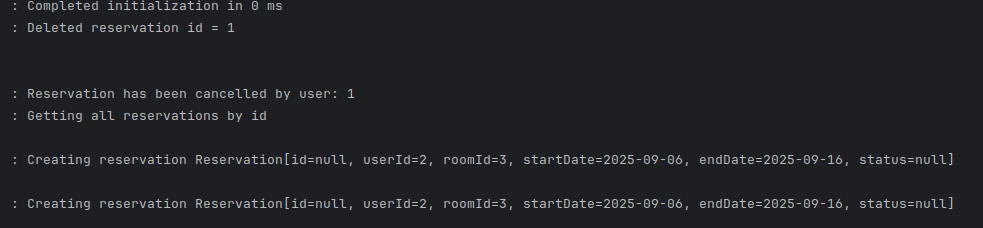

# Reservation System

## 📌 О проекте
Система бронирования (Reservation System), написанная на **Java 21** с использованием **Spring Boot 3**, **PostgreSQL** и **Spring Data JPA**.

Проект предоставляет REST API для управления бронированиями и проверки доступности комнат.

---

## ⚙️ Технологии
- Java 21
- Spring Boot 3 (Web, Data JPA, Validation)
- PostgreSQL
- Hibernate
- Maven
- Docker + Docker Compose

---

## ✨ Возможности
***Бронирования (Reservations)***

 - **Создание нового бронирования**

 - **Просмотр информации о бронировании по ID**

 - **Получение списка всех бронирований** 

 - **Обновление данных бронирования**

 - **Отмена бронирования**

 - **Одобрение бронирования**

 ***Доступность номеров (Availability)***

 - **Проверка доступности комнаты на определённые даты**

***Обработка ошибок***

 - **Глобальный обработчик ошибок (Entity Not Found, Bad Request, Internal Server Error)**

 - *(Возврат структурированного ответа об ошибке с сообщением, временем и деталями**

***Интеграция с базой данных***

 - **Поддержка PostgreSQL через JPA/Hibernate**

 - **Автоматическое создание таблицы reservations**

 - **Валидация дат и статусов бронирования на уровне базы**

---

## 🚀 Запуск проекта

### 1. Клонирование репозитория
```bash
git clone https://github.com/wehw93/reservation-system.git
cd reservation-system
```

### 2. Запуск базы данных PostgreSQL через Docker

В docker-compose.yml описан сервис с PostgreSQL:
```yaml
services:
  postgres:
    image: postgres
    container_name: my-postgres-container
    environment:
      - POSTGRES_USER=my-postgres-user
      - POSTGRES_PASSWORD=pwd123
      - POSTGRES_DB=my-postgres
    volumes:
      - postgres_data:/var/lib/postgresql/data
    ports:
      - "5433:5432"

volumes:
  postgres_data:
```
### Запуск контейнера

```bash
docker-compose up -d
```
### После этого PostgreSQL будет доступен на порту 5433

### Подключитесь к базе данных в вашем IDE 

## Запустите приложение

### Приложение поднимется на http://localhost:8080

---

## 📡 REST API эндпоинты

### Бронирование

 - GET /reservation/{id} – получить бронирование по ID

 - GET /reservation – получить все бронирования

 - POST /reservation – создать бронирование

 - PUT /reservation/{id} – обновить бронирование

 - DELETE /reservation/{id}/cancel – отменить бронирование

 - POST /reservation/{id}/approve – одобрить бронирование

---

## Пример работы

### Я тестирую приложение с помощью Postman



### Видим, что успешно отработал запрос, создадим еще один

### Теперь посмотрим все бронирования



### Видим, что действительно есть бронирования, который мы создавали

### Теперь отменим одно бронирование и посмотрим снова все записи





### Видим, что статус первого бронирования изменился на PENDING

---

### Логирование примеров



